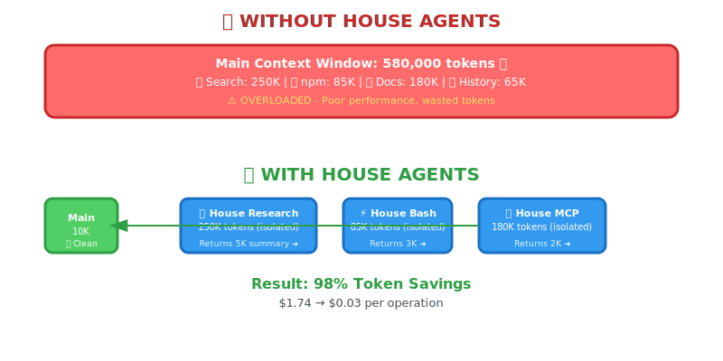

# House Agents

[](https://opensource.org/licenses/MIT)
[](https://github.com/houseworthe/house-agents/releases)
[](https://github.com/houseworthe/house-agents/issues)

Specialized Claude Code sub-agents for context-efficient workflows. Keep your main conversation clean while delegating heavy operations to specialized "house agents."

## The Problem

When working on complex tasks in Claude Code, your context window fills up with:
- Verbose search results from 100+ files
- Long API documentation pages
- npm install logs and build output
- Accumulated conversation history

This "context pollution" reduces Claude's effectiveness and wastes tokens.

## The Solution

**House Agents** are specialized Claude Code sub-agents that run in their own context windows. Each agent handles specific heavy operations and returns condensed results to your main conversation.

<div align="center">
  
</div>

### The Three House Agents

1. **🔍 House Research** - File and documentation search specialist
2. **🔧 House MCP** - Tool configuration and integration specialist
3. **⚡ House Bash** - Command execution and output parsing specialist

## Quick Start

### One-Command Install

**Project-Level (this project only):**

Copy and paste into Claude Code:
```
Clone https://github.com/houseworthe/house-agents to /tmp/house-agents, then copy the .claude directory to my current project. Verify the three agent files exist (.claude/agents/house-research.md, house-mcp.md, house-bash.md), then test house-research by finding all TODO comments in the codebase.
```

**User-Wide (all projects):**

Copy and paste into Claude Code:
```
Clone https://github.com/houseworthe/house-agents to /tmp/house-agents. Create ~/.claude/agents/ directory if it doesn't exist, then copy all .md files from /tmp/house-agents/.claude/agents/ to ~/.claude/agents/. List the installed agents and test house-research by finding README files in the codebase.
```

### Manual Installation

```bash
# 1. Clone the repository
git clone https://github.com/houseworthe/house-agents.git /tmp/house-agents

# 2. Install project-level (current project only)
cp -r /tmp/house-agents/.claude .

# OR install user-wide (all projects)
mkdir -p ~/.claude/agents
cp /tmp/house-agents/.claude/agents/*.md ~/.claude/agents/

# 3. Verify installation
ls .claude/agents/  # or: ls ~/.claude/agents/
```

See [INSTALL.md](./INSTALL.md) for detailed instructions, troubleshooting, and updating.

### How It Works

When you invoke a house agent, Claude Code:
1. Spins up a separate Claude instance with the agent's system prompt
2. Gives it access to specified tools (Read, Grep, Bash, etc)
3. Runs in its own context window (doesn't pollute yours)
4. Returns condensed results to your main conversation

### Testing Your Installation

After installation, test each agent to verify they work:

**1. Test House Research:**
```
Use house-research to find all TODO comments in the codebase
```

Expected: Should return a condensed list of TODOs with file:line references

**2. Test House MCP (if you have MCP tools):**
```
Use house-mcp to show me how to configure environment variables for this project
```

Expected: Should return a working configuration example

**3. Test House Bash:**
```
Use house-bash to check the current git status
```

Expected: Should return a summary of git status (not raw output)

**4. Check agents are loaded:**
```
List all available sub-agents
```

Expected: Should show house-research, house-mcp, and house-bash in the list

**Troubleshooting:**
- If agents don't show up, run `ls .claude/agents/` to verify files exist
- If agents error, check the agent files for syntax errors
- User-level agents: `ls ~/.claude/agents/` to verify installation
- Try `/agents` command in Claude Code to see all loaded agents

### Real-World Test Example

Here's a complete workflow to test all three agents:

**In Claude Code, try this:**

```
1. Use house-research to find all console.log statements in my codebase
2. Use house-bash to run "npm test" and analyze any failures
3. Use house-mcp to show me how to set up a basic Express server with error handling
```

**What you should see:**
- House Research returns: List of files with console.log + line numbers (not full file contents)
- House Bash returns: Test summary with pass/fail counts (not full npm output)
- House MCP returns: Working Express code with comments (not entire documentation)

All in condensed format (5k-10k tokens total instead of 100k+).

## The Agents

### 🔍 House Research

**Use For:**
- Searching large codebases (20+ files)
- Finding patterns across multiple files
- Extracting info from documentation
- Locating TODO comments, deprecated APIs, security issues

**Example Invocations:**
```
"Use house-research to find all React components using useEffect"
"Search for all API endpoints with house-research"
"Find all TODO comments in the backend"
```

**What It Returns:**
- Condensed findings with source references (`file:line`)
- Pattern summaries across files
- Actionable next steps
- Under 5k tokens (typically 90% reduction)

### 🔧 House MCP

**Use For:**
- Configuring complex tools (WordPress, Shopify, Stripe)
- Understanding verbose API documentation
- Generating integration code
- Using MCP tools for external services

**Example Invocations:**
```
"Use house-mcp to configure Contact Form 7 with email validation"
"Set up Stripe webhook handling with house-mcp"
"Configure the Notion API integration"
```

**What It Returns:**
- Working configuration code
- Minimal usage examples
- Important gotchas and notes
- Under 3k tokens (typically 88% reduction)

### ⚡ House Bash

**Use For:**
- Running build commands
- Executing test suites
- Running deployment scripts
- Multi-step command sequences

**Example Invocations:**
```
"Use house-bash to run npm test and analyze failures"
"Run the build with house-bash and check for warnings"
"Execute the deployment script"
```

**What It Returns:**
- Clear success/failure status
- Error analysis with suggested fixes
- Key metrics (test counts, build time)
- Relevant output snippets (not full logs)
- Under 4k tokens (typically 85% reduction)

## When to Use House Agents

### ✅ Use House Agents For

- **Large codebases** (100+ files)
- **Verbose documentation** (10+ pages)
- **Long command output** (npm install, test runs)
- **Multi-step workflows** (search → configure → execute)
- **When hitting context limits** (conversation getting sluggish)

### ❌ Use Main Claude For

- **Simple tasks** (single file edits)
- **Small codebases** (<20 files)
- **Interactive debugging** (tight feedback loops)
- **Quick commands** (ls, git status)
- **Learning/exploration** (when you want full context)

## Token Savings

Real-world examples:

| Task | Without House Agents | With House Agents | Savings |
|------|---------------------|-------------------|---------|
| Search 100 files | 250k tokens | 5k tokens | **98%** |
| Configure WordPress plugin | 180k tokens | 2k tokens | **99%** |
| Run test suite | 150k tokens | 3k tokens | **98%** |
| Multi-step workflow | 580k tokens | 10k tokens | **98%** |

**Cost Impact:** At $3/M input tokens, a complex task saves ~$1.50 per operation.

## Architecture

```
Main Claude Code Session
├── Clean context (~20k tokens)
├── Focus on implementation
└── Receives condensed results from:
    │
    ├─→ House Research (separate context)
    │   ├── Searches 100 files (250k tokens in its context)
    │   └── Returns 5k token summary to main
    │
    ├─→ House MCP (separate context)
    │   ├── Reads verbose docs (180k tokens in its context)
    │   └── Returns 2k token config to main
    │
    └─→ House Bash (separate context)
        ├── Runs commands (150k tokens output in its context)
        └── Returns 3k token summary to main

Your main context: 10k tokens (instead of 580k!)
```

## Tips & Best Practices

### Invoke Explicitly When Needed
```
✅ "Use house-research to find all components"
❌ "Find all components" (main Claude might search inefficiently)
```

### Combine Agents for Complex Tasks
```
"Use house-research to find all API endpoints, then use house-bash to run the integration tests"
```

### Let Agents Do Their Job
```
✅ "Use house-research to analyze the auth system"
❌ "Use house-research to read auth.js" (too specific, just use Read)
```

### Check Agent Responses
Agents are focused on their specialty - review their findings before implementing changes.

## Customization

Each agent file (`.md` format with YAML frontmatter) has two parts:

**1. Frontmatter** (metadata):
```yaml
name: house-research
description: "When to use this agent"
tools: Read, Grep, Glob
model: inherit
```

**2. System Prompt** (instructions):
```
You are the House Research Agent...
[detailed instructions for the agent]
```

Edit the agent files to customize:
- Which tools each agent can access
- The agent's behavior and output format
- Token budgets and priorities
- When the agent should be invoked proactively

## Project vs User Level

**Project-level** (`.claude/agents/` in project):
- Available only in this project
- Project-specific customizations
- Committed to git (if you want)

**User-level** (`~/.claude/agents/`):
- Available in ALL your projects
- Personal preferences and defaults
- Not in version control

Claude Code loads both, with project-level taking precedence.

## Gotchas & Limitations

1. **Not faster** - Sub-agents add latency (~2-5s per invocation)
2. **No shared memory** - Each agent starts fresh (no state between calls)
3. **Cost**: More API calls, but often fewer total tokens = lower cost
4. **Learning curve** - Knowing when to use which agent takes practice

## Examples

See [USAGE.md](./USAGE.md) for detailed examples:
- Refactoring a large codebase
- Configuring complex integrations
- Running CI/CD pipelines
- Multi-agent workflows

## Contributing

These agents are templates - customize them for your workflow:

1. Fork and modify the YAML files
2. Share your custom agents
3. Report issues or suggest improvements

## License

MIT - Use however you want

---

Built for Claude Code users who work on complex projects and want to keep their context clean and focused.
