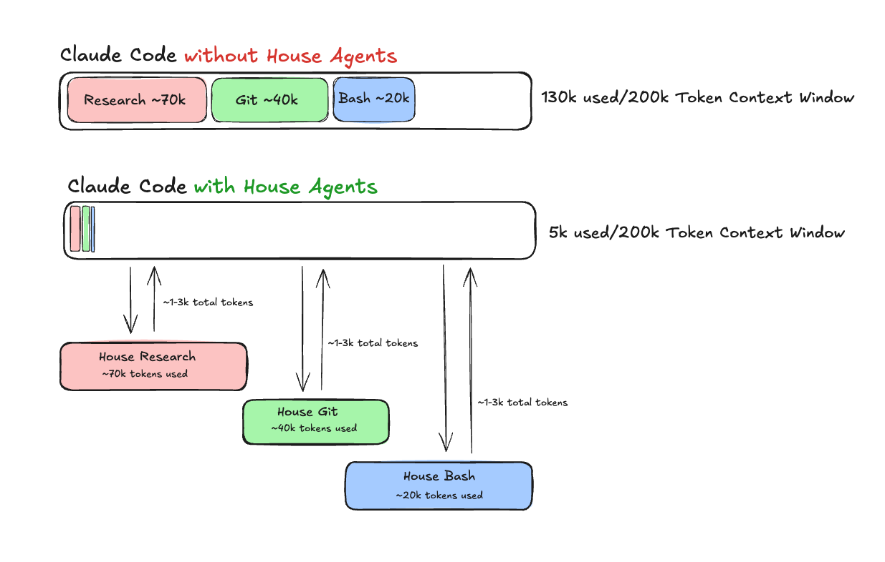

# House Agents

[](https://opensource.org/licenses/MIT)
[](https://github.com/houseworthe/house-agents/releases)
[](https://github.com/houseworthe/house-agents/issues)

> **⚠️ Beta Software (v0.2.0-beta)**
>
> House Agents is in active development. Core features are stable, but agent configurations
> and APIs may change. Please report issues at [GitHub Issues](https://github.com/houseworthe/house-agents/issues).



Specialized Claude Code sub-agents for context-efficient workflows. Keep your main conversation clean while delegating heavy operations to specialized "house agents."

## The Problem

When working on complex tasks in Claude Code, your context window fills up with:
- Verbose search results from 100+ files
- Long API documentation pages
- npm install logs and build output
- Accumulated conversation history

This "context pollution" reduces Claude's effectiveness and wastes tokens.

## The Solution

**House Agents** are specialized Claude Code sub-agents that run in their own context windows. Each agent handles specific heavy operations and returns condensed results to your main conversation.

> **Measured in Production**
>
> Recent validation from actual usage:
> - **house-research**: 70,100 tokens processed → 3,246 returned (95.4% savings)
> - **house-git**: 42,900 tokens processed → ~500 returned (98.8% savings)
> - **house-bash**: 20,600 tokens processed → ~700 returned (96.6% savings)
>
> Total: 133,600 tokens quarantined, ~4,500 added to main context

### The Three House Agents

1. **🔍 House Research** - File and documentation search specialist
2. **🔀 House Git** - Git diff and commit analysis specialist
3. **⚡ House Bash** - Command execution and output parsing specialist

See [Future Agents](#future-agents) for planned additions (house-mcp, house-vision, house-data).

### Model Architecture

**Main Claude**: Uses your selected model (Sonnet 4.5, Opus, etc.)
**Sub-agents**: Use Claude Haiku 4.5 for cost-efficiency and speed

Sub-agents perform specialized, focused tasks (grep, bash parsing, git analysis) where Haiku 4.5's performance (90% of Sonnet 4.5's agentic coding capability) is more than sufficient. This architecture provides:

- **67% cost savings** on sub-agent operations ($1/$5 vs $3/$15 per million tokens)
- **2x faster** response times compared to Sonnet 4
- **Appropriate model** for each task's complexity level

The main conversation uses your chosen model for complex decision-making, while sub-agents use the faster, more cost-effective Haiku 4.5 for heavy-lifting operations.

**Note**: You can override this by editing agent files and changing `model: claude-haiku-4-5-20251001` to `model: inherit` to use the main conversation's model.

## Quick Start

### One-Command Install

**Project-Level (this project only):**

Copy and paste into Claude Code:
```
Clone https://github.com/houseworthe/house-agents. Detect my OS and use appropriate commands to copy the .claude directory to my current project (use Git Bash commands on Windows if available, otherwise try PowerShell). After copying, verify all three agent files exist in .claude/agents/ directory. Then list all available sub-agents to confirm they're loaded. Finally, test house-research by asking it to find all TODO comments in the codebase - make sure to invoke it correctly as a sub-agent.
```

**User-Wide (all projects):**

Copy and paste into Claude Code:
```
Clone https://github.com/houseworthe/house-agents. Detect my OS and create ~/.claude/agents/ directory (or Windows equivalent %USERPROFILE%\.claude\agents\). Copy all .md files from the cloned repo's .claude/agents/ to that directory using OS-appropriate commands. List the installed files, then list all available sub-agents to confirm they loaded. Test house-research by finding README files in the current directory - invoke it as a sub-agent.
```

### Manual Installation

```bash
# 1. Clone the repository
git clone https://github.com/houseworthe/house-agents.git /tmp/house-agents

# 2. Install project-level (current project only)
cp -r /tmp/house-agents/.claude .

# OR install user-wide (all projects)
mkdir -p ~/.claude/agents
cp /tmp/house-agents/.claude/agents/*.md ~/.claude/agents/

# 3. Verify installation
ls .claude/agents/  # or: ls ~/.claude/agents/
```

See [INSTALL.md](./INSTALL.md) for detailed instructions, troubleshooting, and updating.

### How It Works

When you invoke a house agent, Claude Code:
1. Spins up a separate Claude instance with the agent's system prompt
2. Gives it access to specified tools (Read, Grep, Bash, etc)
3. Runs in its own context window (doesn't pollute yours)
4. Returns condensed results to your main conversation

### Testing Your Installation

After installation, test each agent to verify they work:

**1. Test House Research:**
```
Use house-research to find all TODO comments in the codebase
```

Expected: Should return a condensed list of TODOs with file:line references

**2. Test House Bash:**
```
Use house-bash to check the current git status
```

Expected: Should return a summary of git status (not raw output)

**3. Test House Git:**
```
Use house-git to review my current git diff
```

Expected: Should return a condensed summary of changes (not raw diff output)

**4. Check agents are loaded:**
```
List all available sub-agents
```

Expected: Should show house-research, house-git, and house-bash in the list

**Troubleshooting:**
- If agents don't show up, run `ls .claude/agents/` to verify files exist
- If agents error, check the agent files for syntax errors
- User-level agents: `ls ~/.claude/agents/` to verify installation
- Try `/agents` command in Claude Code to see all loaded agents
- For house-git: If "no changes" message appears, make some test edits first

### Real-World Test Example

Here's a complete workflow to test all agents:

**In Claude Code, try this:**

```
1. Use house-research to find all console.log statements in my codebase
2. Use house-bash to run "npm test" and analyze any failures
3. Use house-git to review my recent git changes
```

**What you should see:**
- House Research returns: List of files with console.log + line numbers (not full file contents)
- House Bash returns: Test summary with pass/fail counts (not full npm output)
- House Git returns: Change summary by impact (Critical/Medium/Minor) (not raw diff output)

All in condensed format (3k-8k tokens total instead of 50k+).

## The Agents

### 🔍 House Research

**Use For:**
- Searching large codebases (20+ files)
- Finding patterns across multiple files
- Extracting info from documentation
- Locating TODO comments, deprecated APIs, security issues

**Example Invocations:**
```
"Use house-research to find all React components using useEffect"
"Search for all API endpoints with house-research"
"Find all TODO comments in the backend"
```

**What It Returns:**
- Condensed findings with source references (`file:line`)
- Pattern summaries across files
- Actionable next steps
- Real example: Codebase search across 10+ files processed 70k tokens, returned 3.2k (95.4% savings)

### ⚡ House Bash

**Use For:**
- Running build commands
- Executing test suites
- Running deployment scripts
- Multi-step command sequences

**Example Invocations:**
```
"Use house-bash to run npm test and analyze failures"
"Run the build with house-bash and check for warnings"
"Execute the deployment script"
```

**What It Returns:**
- Clear success/failure status
- Error analysis with suggested fixes
- Key metrics (test counts, build time)
- Relevant output snippets (not full logs)
- Parsed summaries instead of raw command output

### 🔀 House Git

**Use For:**
- Reviewing large diffs (100+ line changes)
- Branch comparison before merging
- Commit history analysis
- Merge conflict identification
- Change impact assessment

**Example Invocations:**
```
"Use house-git to review my staged changes"
"Compare feature-branch with main using house-git"
"Analyze the last 10 commits with house-git"
```

**What It Returns:**
- Summary: X files changed, Y insertions, Z deletions
- Key changes by impact (Critical/Medium/Minor)
- Changes grouped by file type (source/tests/config/docs)
- Merge conflict locations (if applicable)
- Recommendations for review focus

## When to Use House Agents

### ✅ Use House Agents For

- **Large codebases** (100+ files)
- **Verbose documentation** (10+ pages)
- **Long command output** (npm install, test runs)
- **Multi-step workflows** (search → configure → execute)
- **When hitting context limits** (conversation getting sluggish)

### ❌ Use Main Claude For

- **Simple tasks** (single file edits)
- **Small codebases** (<20 files)
- **Interactive debugging** (tight feedback loops)
- **Quick commands** (ls, git status)
- **Learning/exploration** (when you want full context)

## Architecture

```
Main Claude Code Session
├── Clean context
├── Focus on implementation
└── Receives condensed results from:
    │
    ├─→ House Research (separate context)
    │   ├── Searches 70k+ tokens across 10+ files
    │   └── Returns 3k token summary (95% savings)
    │
    ├─→ House Git (separate context)
    │   ├── Analyzes 43k token diff
    │   └── Returns 500 token summary (98% savings)
    │
    └─→ House Bash (separate context)
        ├── Processes 21k+ tokens of command output
        └── Returns 700 token summary (97% savings)

Heavy operations happen in agent contexts, not yours.
```

## Tips & Best Practices

### Invoke Explicitly When Needed
```
✅ "Use house-research to find all components"
❌ "Find all components" (main Claude might search inefficiently)
```

### Combine Agents for Complex Tasks
```
"Use house-research to find all API endpoints, then use house-bash to run the integration tests"
```

### Let Agents Do Their Job
```
✅ "Use house-research to analyze the auth system"
❌ "Use house-research to read auth.js" (too specific, just use Read)
```

### Check Agent Responses
Agents are focused on their specialty - review their findings before implementing changes.

## Customization

Each agent file (`.md` format with YAML frontmatter) has two parts:

**1. Frontmatter** (metadata):
```yaml
name: house-research
description: "When to use this agent"
tools: Read, Grep, Glob
model: inherit
```

**2. System Prompt** (instructions):
```
You are the House Research Agent...
[detailed instructions for the agent]
```

Edit the agent files to customize:
- Which tools each agent can access
- The agent's behavior and output format
- Token budgets and priorities
- When the agent should be invoked proactively

## Project vs User Level

**Project-level** (`.claude/agents/` in project):
- Available only in this project
- Project-specific customizations
- Committed to git (if you want)

**User-level** (`~/.claude/agents/`):
- Available in ALL your projects
- Personal preferences and defaults
- Not in version control

Claude Code loads both, with project-level taking precedence.

## Gotchas & Limitations

1. **Not faster** - Sub-agents add latency (~2-5s per invocation)
2. **No shared memory** - Each agent starts fresh (no state between calls)
3. **Cost**: More API calls, but often fewer total tokens = lower cost
4. **Learning curve** - Knowing when to use which agent takes practice
5. **MCP Tool Access (Known Bug)** - Sub-agents currently cannot access MCP tools due to [Issue #7296](https://github.com/anthropics/claude-code/issues/7296). This affects potential future agents (house-mcp, house-data) that would benefit from MCP integrations. Current production agents (house-research, house-bash, house-git) use built-in tools only.

## Examples

See [USAGE.md](./USAGE.md) for detailed examples:
- Refactoring a large codebase
- Configuring complex integrations
- Running CI/CD pipelines
- Multi-agent workflows

## Future Agents

The following agents are planned but not yet implemented due to technical limitations:

### 🔧 House MCP (Blocked - MCP Bug #7296)
- **Status**: Disabled - waiting for MCP tool access fix
- **Purpose**: Tool configuration and API documentation specialist
- **Blocker**: Sub-agents cannot access MCP servers
- **ETA**: Once Claude Code bug #7296 is resolved

### 📸 House Vision (Research Phase)
- **Status**: Planned - researching optimal approach
- **Purpose**: Screenshot and UI analysis
- **Challenge**: Image context must be file-based to save tokens
- **Use Case**: Iterative UI review from screenshot files

### 📊 House Data (Research Phase)
- **Status**: Planned - requires CLI tool prerequisites
- **Purpose**: Database query and CSV analysis
- **Challenge**: Needs database CLI tools (sqlite3, psql, mysql)
- **Blocker**: MCP database servers also affected by bug #7296

Want to contribute? See [CONTRIBUTING.md](./CONTRIBUTING.md) for agent development guidelines.

## Contributing

These agents are templates - customize them for your workflow:

1. Fork and modify the agent files
2. Share your custom agents
3. Report issues or suggest improvements

## License

MIT - Use however you want

---

Built for Claude Code users who work on complex projects and want to keep their context clean and focused.
